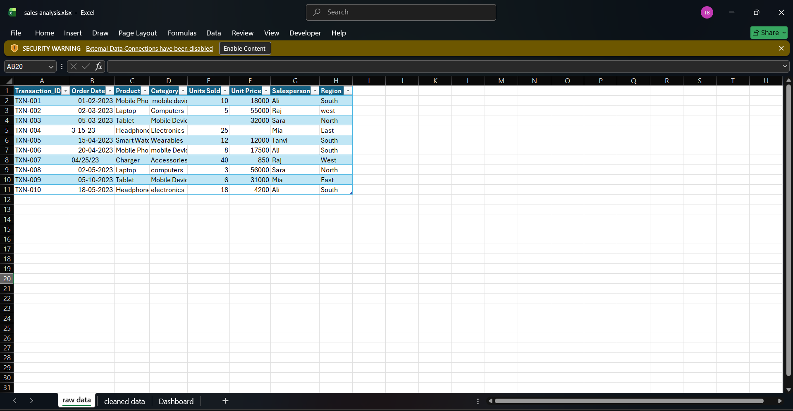

# Sales-analysis-excel
Interactive sales analysis dashboard built in Excel

## 📊 Project Overview
1.This project analyzes sales transaction data using Microsoft Excel.
2.The goal is to identify revenue trends, top-performing salespersons and regional performance using PivotTables and an interactive dashboard.

## 📌 Project Workflow
Raw Data ➡️ Data cleaning & transformation using excel ➡️ excel Dashboard

## 🛠 Tools Used
- Microsoft Excel (Power Query, PivotTables, Slicers)

## 📊 Dataset Information
Columns: Transaction ID,order date,product,category,sales person,region,revenue etc.

Source: some random AI source (csv format)

Format: Raw CSV file cleaned and loaded within excel.

## 🔧 Steps Involved
1.imported raw data(csv) and cleaned that data using power query in Excel (fixed missing values and standardized names) and loaded into it.

2.Explored the data to find key trends in sales and revenues.

3.Created pivot tables such as Total Revenue by month, Total Revenue by region etc..

4.Built interactive dashboard with slicers, charts for easy analysis.

## 📈 Dashboard Pages
1.Raw Data

2.cleaned data with pivot tables and insights

3.Sales Dashboard

## 📈 Key Insights
- Ali is the top revenue-generating salesperson
- South region contributes the highest revenue
- April shows peak monthly sales
- High units sold do not always mean high revenue

## 📄 page 1: Raw Data
Raw Data Description

This sheet contains the original transactional sales data collected for analysis.
It represents individual sales transactions without any transformations or calculations.

